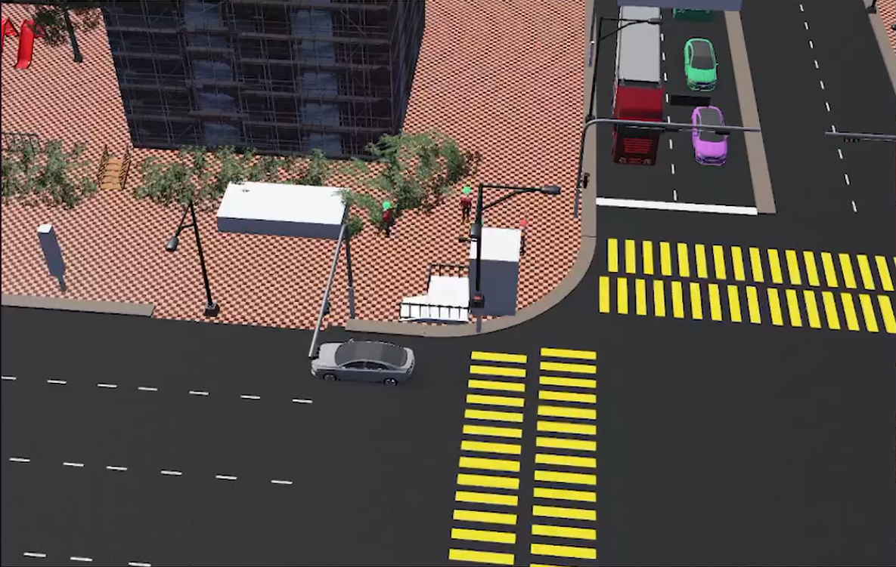
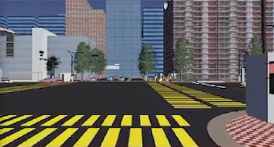
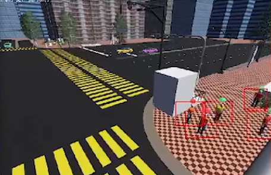
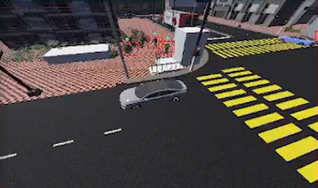

# BlindGuard AI

**도로변 카메라 기반 사각지대 보행자 차로 진입 예측 및 차량별 사전 경고**

`Edge Vision → Intent Prediction → Vehicle Matching → Alert Decision → Driver App`

**Repository scope:** 시스템 아키텍처 · Webots 시뮬레이션 · 평가 설계

## Architecture

| 모듈 | 입력 | 처리 | 출력 |
|---|---|---|---|
| Edge Vision | 도로변 카메라 영상 | 보행자 탐지·추적, 차로 경계 기준 이동 분석 | 보행자 위치·궤적 |
| Intent Prediction | 보행자 궤적 | 차로 진입 여부 및 진입 시간 창 추정 | `T_ped` |
| Vehicle Matching | 차량 GPS | 접근 차량 식별 및 도착 시간 창 계산 | `T_veh` |
| Alert Decision | `T_ped`, `T_veh`, 구간 가시거리 | 시간 창 중첩 및 제동 가능 거리 비교 | 차량별 경고 여부 |
| Driver App | 경고 이벤트 | 알림 표시 | 운전자 사전 경고 |

## Alert rule

**경고 조건:** `overlap(T_ped, T_veh) AND (D_vis < D_stop)`

| 변수 | 의미 |
|---|---|
| `T_ped` | 보행자 차로 진입 예상 시간 창 |
| `T_veh` | 차량의 해당 구간 도착 예상 시간 창 |
| `D_vis` | 해당 구간에서 보행자를 확인할 수 있는 거리 |
| `D_stop` | 차량의 정지 거리 |

**보정 항목:** 경고 임계값, 가시거리·정지 거리 산정 기준

## Simulation

  

Additional viewpoints

| 도로 정면 | 교차로 측면 | 교차로 상공 |
|:---:|:---:|:---:|
|  |  |  |

**시뮬레이션 항목:** 차량·보행자 동선, 차로 진입, 시야 가림, 구간별 가시거리, 경고 타이밍

## Development status

| 영역 | 상태 | 다음 작업 |
|---|---|---|
| Webots 환경 | 구성 중 | 보행자 진입·가림 시나리오 및 가시거리 측정 |
| Edge Vision | 탐지 시험 중 | 상부 시점 데이터 확보, 추적 및 차로 좌표 변환 |
| Intent Prediction | 설계 중 | 규칙 기반 baseline과 확률적 예측 모델 비교 |
| Vehicle Matching · Alert | 설계 중 | GPS 연동, 차량별 경고 조건 및 전체 지연 측정 |

## Evaluation

- **Vision:** 작은 보행자·가림 조건에서의 탐지·추적 성능
- **Prediction:** 차로 진입 여부, 진입 시간 오차, 조기 예측 가능 시간
- **Alert:** 적시 경고율, 불필요 경고율, 촬영부터 알림까지의 지연
- **Ablation:** 반경 기반 경고 / 시간 창 매칭 / 시간 창 + 가시거리 조건 비교

## Team

| 담당 | 역할 |
|---|---|
| 홍정민 | 전체 파이프라인, Vision 및 보행자 동작 의도 연구 |
| 정서현 | Webots 시뮬레이션 및 시나리오 구성 |
| 장지민 | 선행 연구 조사, 데이터·실험 자료 정리 |
